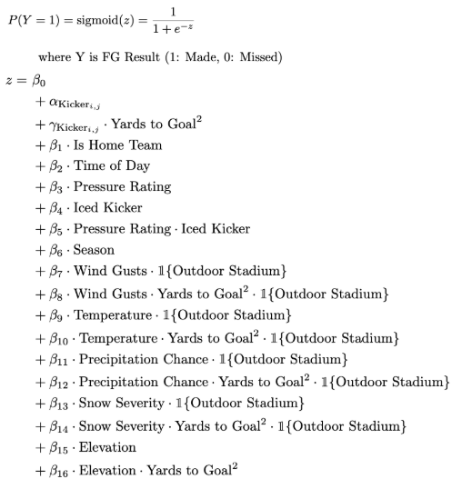
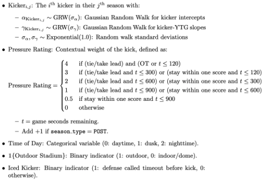
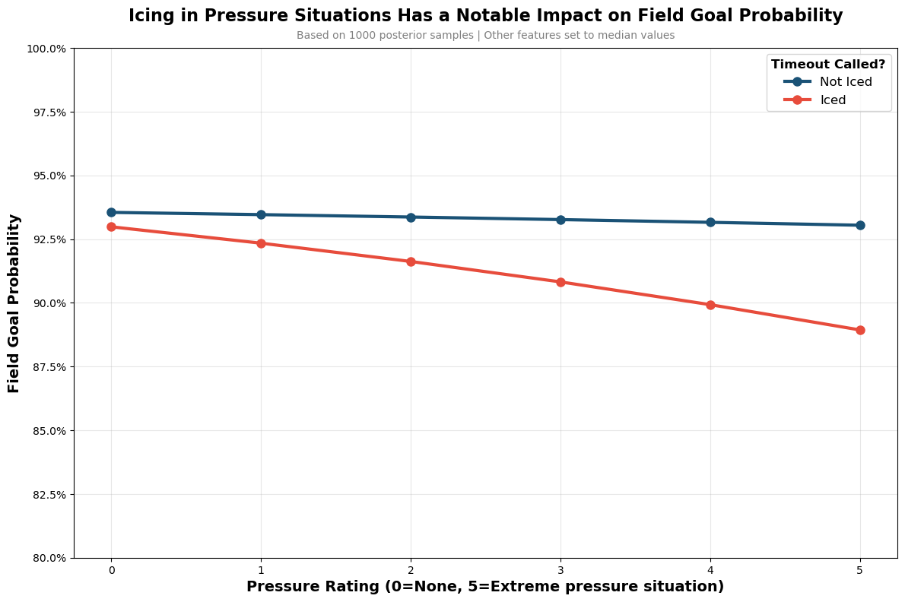
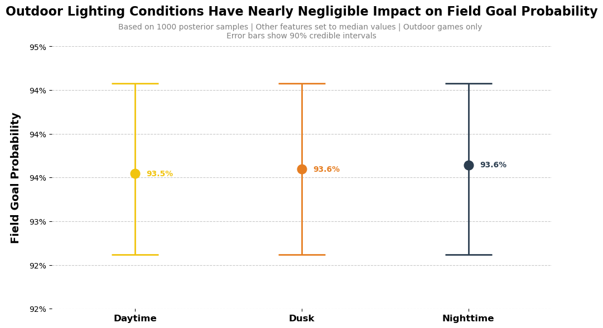
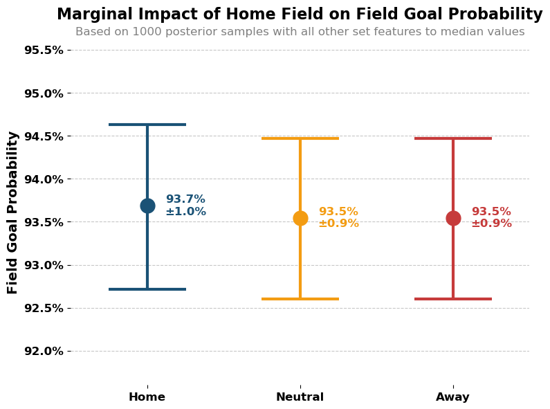
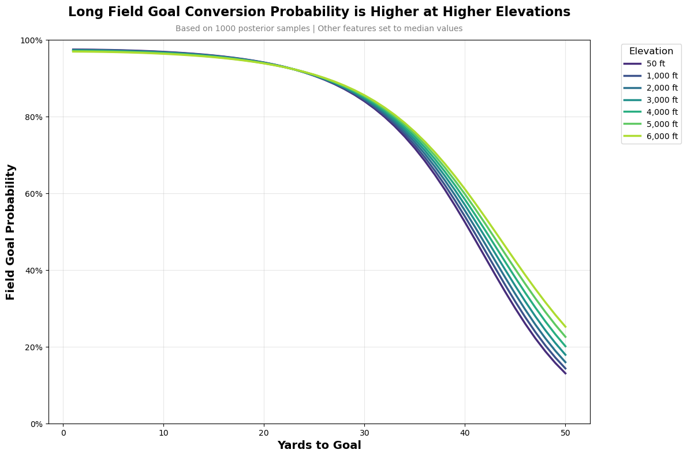
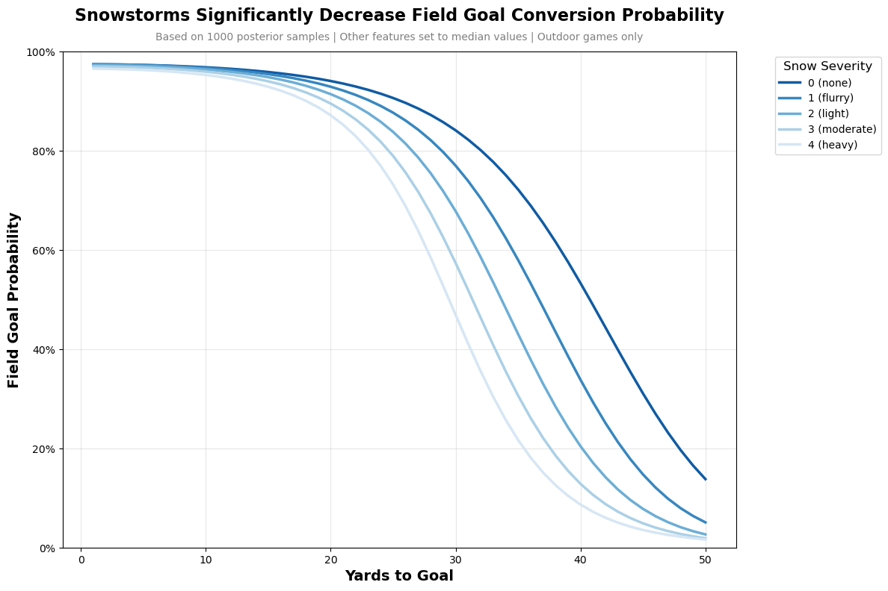
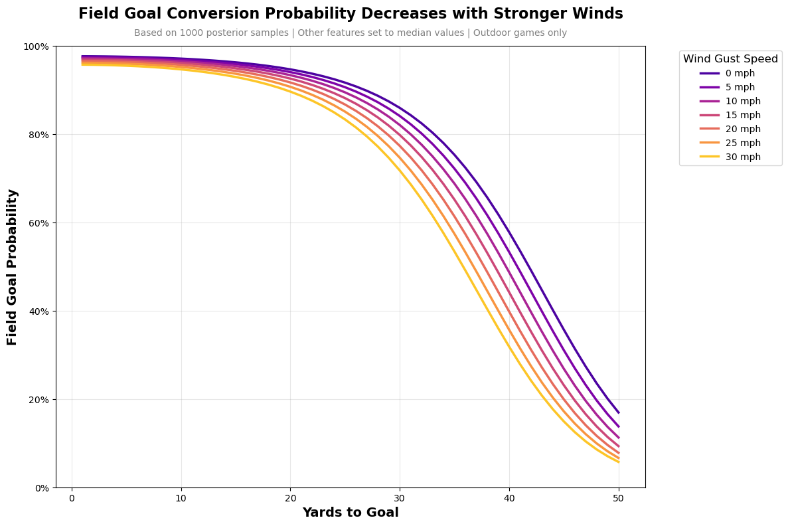
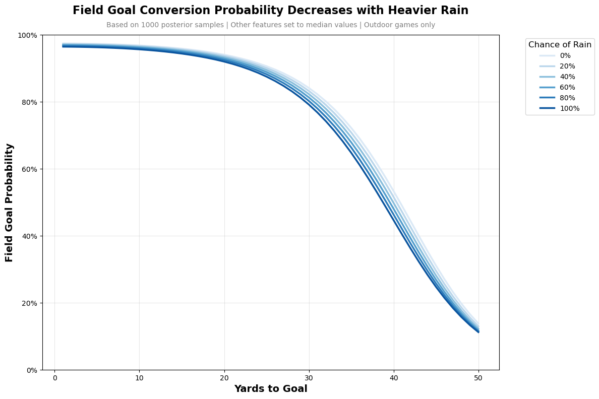
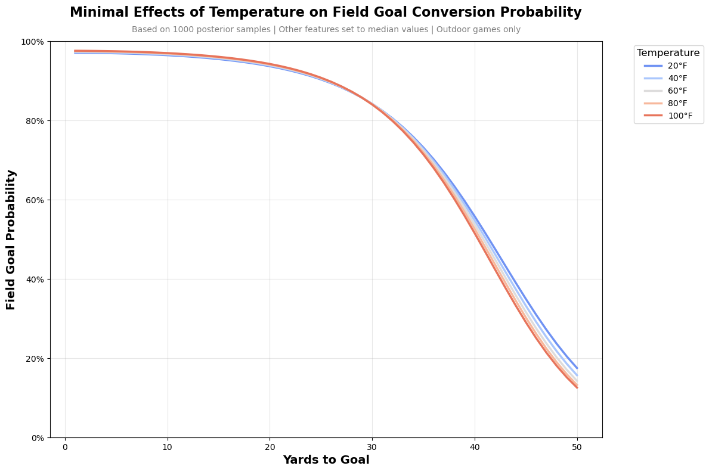

## 2024 Kicker Ranked by Field Goal Points Above Replacement


## 🔍 Modeling Overview

### Modeling Goals

- Estimate FG make probability using Bayesian hierarchical logistic regression.
- Quantify kicker performance using **Field Goal Points Above Replacement (FGPAR)**.
- Account for both **aleatoric** and **epistemic** uncertainty.
- Capture kicker-specific trends while allowing for generalization across players.

### Process Summary

- **Selection Bias Check**: A Heckman selection model was used to check if field goal attempt decisions bias FG conversion modeling. The inverse Mills ratio (IMR) was not statistically significant (p = 0.115), so it was excluded from the final model.
- **Main Feature**: `yards_to_goal²` outperformed linear, cubic, and quartic terms based on R² and showed the most linear relationship with FG success rate — preferred due to model interpretability and convergence in Bayesian logistic regression.
- **Model Architecture**:
  - Bayesian hierarchical logistic regression
  - Gaussian random walk priors for kicker intercepts across seasons
  - Partial pooling to stabilize estimates for kickers with limited data
  - Interaction terms for:
    - Pressure situations × Icing
    - Weather × Yards-to-goal
    - Elevation × Yards-to-goal

### Model Structure
#### Model Definition


#### Feature Definitions


---

## 📈 Model Performance

| Model            | Brier ↓ | AUC ↑   | LOOIC ↓ |
|------------------|---------|---------|---------|
| Simple           | 0.1064  | 0.7755  | 7249.7  |
| Complex          | 0.1063  | 0.7804  | 7503.9  |
| Jacob Long Model | 0.1160  | 0.7811  | 8032.7  |

- The **Simple model** (only yards-to-goal²) performs best overall, except for AUC.
- The **Complex model** treats yards-to-goal as a kicker-specific Gaussian walk, which may dilute the signal.
- Both models outperform Jacob Long’s FG model, potentially because blocked kicks were excluded from training in this model. Blocked FG probability will be modeled separately when deciding whether to kick or go for it.

---

## ❄️🌧️ Contextual Effects on FG Success Rate

### Icing, Lighting, Elevation, and Home Field






### Weather Conditions






---

## 🏈 Replacement Kicker Definition

A kicker is considered **replacement level** if one of the following conditions is met:

### Case 1: Midseason Pickup
- First to attempt a kick for their team that season
- Not on active roster in Week 1
- Not retained as the starter the following season
- Did not kick for the same team in the previous season

### Case 2: Short-Term Rookie
- Rookie kicker with fewer than 10 attempts in both their 3rd and 4th seasons with that team

These definitions aim to identify short-term or temporary starters who are not retained, forming a baseline to evaluate FG points above replacement (FGPAR).

---

## 📝 Additional Materials

See [`about.pdf`](about.pdf) for a presentation version of this content, including slides that describe the modeling process and results.

---

## 🔗 References

- [Jacob Long's FG Model](https://github.com/jacob-long/nfl-fg-model)

## Setting up the environment

### 1. Create the conda environment
First, create the conda environment from the `environment.yml` file:
```bash
conda env create -f environment.yml
```

### 2. Activate the environment
Activate the newly created environment:
```bash
conda activate nfl-fg
```

### 3. Create a Jupyter kernel
Create a Jupyter kernel for this environment so you can use it in Jupyter notebooks:
```bash
python -m ipykernel install --user --name nfl-fg
```

### 4. Verify the installation
You can verify that the kernel was created successfully by listing all available kernels:
```bash
jupyter kernelspec list
```

### 5. Start Jupyter
Open one of the notebooks and select the `nfl-fg` kernel.
